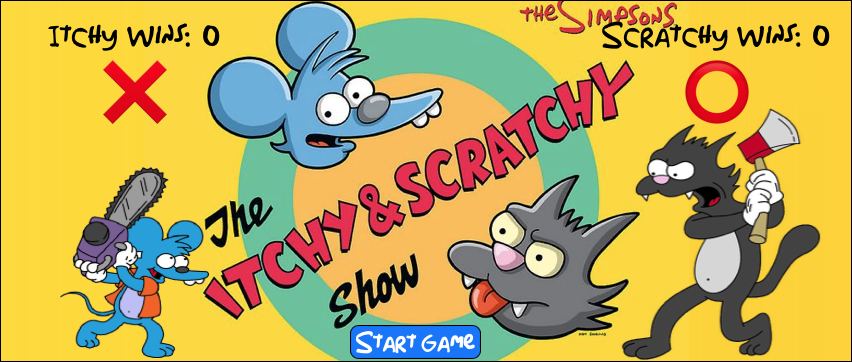
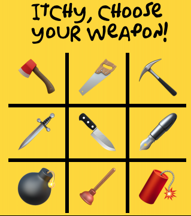
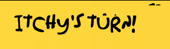

## What’s going on here?:
This project was designed and built by Catalyst for my Turing School of Software & Design Module 1 final solo project. The goal was to create a working Tic-Tac-Toe game that keeps track of and displays players' turns and scores. 
Project expectations can be found here: https://frontend.turing.edu/projects/module-1/tic-tac-toe-solo-v2.html
GitHub repo can be found here: https://github.com/Catalyst4Change/tic-tac-toe

I enjoyed building this and honing the visual style to be consistent with the source material. Once I finished the basic code to complete all the requested functionality, I added a few touches of my own. First the ability to choose one’s preferred weapon from the grid and then a title card/splash screen to introduce the game.

## How do I play?:
*Start the game by pressing the Start Game button.\
*Player 1 (Itchy Mouse) choses their weapon from the grid.\
*I recommend finding a second person to play against.\
*Player 2 (Scratchy Cat) choses theirs next.\
*The game starts and players take turns placing a token on the board. \
*Player turns and scores are displayed on the screen.\
*Align three tokens before your opponent to win! Game Over.\
*If all grid spaces are filled with tokens and no player has won the game is a draw. Game Over.\
*Three seconds after a Game Over, the board resets to empty and the game begins again!

## Why does it look like that?:
The look of this game evolved over the course of the project. As a big “The Simpsons” fan, the thought of Itchy & Scratchy battling it out via a grid of weapons was pretty funny. I utilized basic emojis as the game tokens.

## How did you make this?:
This project is made entirely with vanilla JavaScript, HTML, & CSS. It probably took me 24 manhours.
I am very proud of it and how well it works. I was not able to generate any game-breaking bugs past the functionality phase.

I had a huge problem getting started with this. I started off mirroring many of our previous JavaScript projects which led me to have unnecessary, flow-breaking code. Once I was guided to remove this, the sequence of logic needed to complete the tasks developed rather quickly. I had drawn out what I wanted to happen as a flow chart beforehand. From there it was only a matter of translating it onto code.

My biggest problem was a logic-breaking problem late in the functionality phase. There is a timer that runs at any Game Over state. Whenever that timer would run, the following code would return all variables as undefined. This confused and angered me because my code looked legit. Eventually, I learned that nested functions cause `this` to "lose context". Basically JavaScript seems to lose track of where it put that those dang variables. Boy, I can totally relate. Sometimes I’ll be working on something and be like “Where are my pliers? I just had them right in my hand and now they’re GONE.” I was only able to overcome this issue with help from some friends who’re Turing alums. They recommended an anonymous function as a buffer which keeps `this` in reference.

My favorite part (aside from giggling about cartoon animals fighting to the death) was implementing the weapon choice feature. I set everything up the way that I expected it to work and refreshed my demo page. The gridded array of weapons displayed perfectly. The players’ choices were saved and recalled as game tokens. My code ran exactly as expected, on the first try, with no bugs! I was legitimately surprised, but also very proud of myself in that moment.

There does seem to be some visual artifacting around the text when the center banner message changes. I think this may be a a result of using a custom font with irregular kerning. If I am to continue working on this project I would look for ways to scrub or update those lagging pixels.

## Domo arigato:
I would like to thank my mentor Alia, and my friends Grace & Evan. They helped me over the roadblocks that stalled my progress and encouraged me along the way.

Pre-emptive thanks to the Disney(c) Corporation for not suing me for using their IP.
